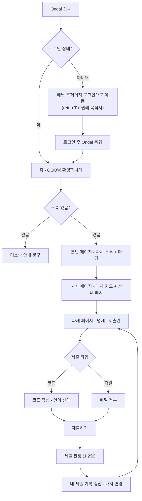
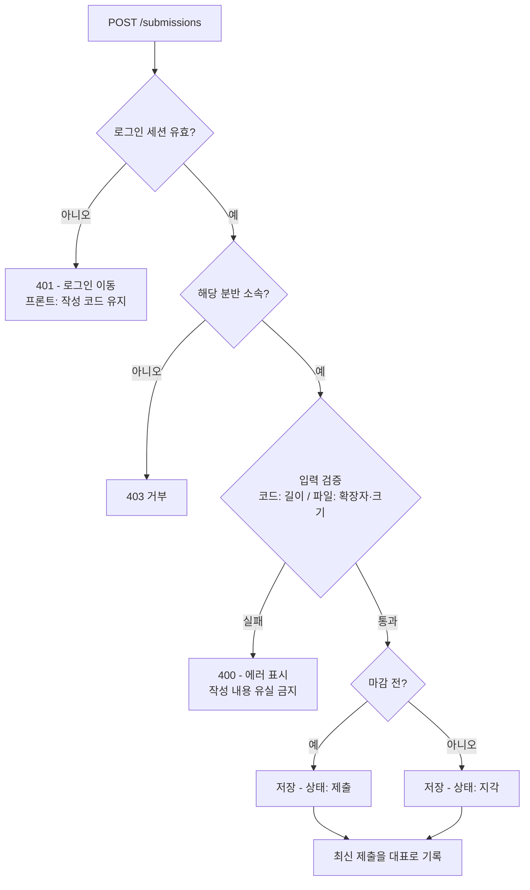
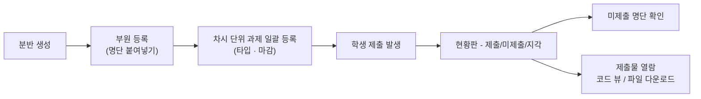

# Ondal 플로우 & 유스케이스 (P1)

> 기준: 레이아웃 v2.1 (2026-08, 학생 흐름 5화면) + `docs/mvp-scope.md`
> 화면(레이아웃)과 코드(API·도메인) 사이의 다리 - 플로우의 분기 = 코드의 if, 유스케이스의 예외 = 에러 처리 목록.

## 0. 레이아웃 v2.1 반영 메모

| 수정 | 반영 |
|------|------|
| 분반명 예시 "2026-2 C언어" | 분반 이름은 자유 텍스트(언어·과목 기반 명명). 모델 변경 없음 |
| 회원가입 → "해달 홈페이지 리다이렉션(?)" | 링크로 처리 (Ondal이 계정을 만들지 않는 원칙 유지). 홈페이지 가입 URL 확정 필요 → 3절-10 |
| "지각 제출(지각은 생각해보기)" | 미결로 격상 후 **2026-08-19 확정: 전 과제 지각 허용 + 표시** → 3절-1 |
| "추후 슬롯 (P1 미노출)" 마커 삭제됨 | 의도 확인 필요 - P1에 보여줄 거면 비활성 상태 디자인이 필요해짐 → 3절-9 |

---

## 1. 플로우차트

### 1.1 학생 메인 플로우 (화면 이동)

### 1.2 제출 판정 (서버 로직)

- 지각 정책(2026-08-19 확정): 마감 후 제출은 차단하지 않고 **지각으로 표시** - 상태 4종 계산 규칙은 [db/schema.md](db/schema.md) 3절
- 마감 판정 시각: **서버 수신 시각** 기준 (클라이언트 시계 불신). 저장은 UTC, 표시는 KST
- 재제출: 무제한 (2026-08-19 확정 - 이력 append-only 보존, 최신이 대표. [db/schema.md](db/schema.md) 결정 1)

### 1.3 운영진 플로우

---

## 2. 유스케이스

### 2.1 액터

| 액터 | 정의 | 권한 근거 |
|------|------|-----------|
| 학생 | 분반에 student로 등록된 부원 | `Enrollment.role = student` |
| 운영진 | 분반 운영 권한자 | `Enrollment.role = operator` |
| 관리자 | 시스템 전체 관리 (Root) | `User.global_role = admin` |
| 해달 홈페이지 | 외부 시스템 - 인증·계정 담당 | 연동 방식 미확정 |

### 2.2 유스케이스 목록 (P1)

| ID | 액터 | 유스케이스 | 비고 |
|----|------|-----------|------|
| UC-S1 | 학생 | 로그인 (홈페이지 위임) | returnTo 복귀 포함 |
| UC-S2 | 학생 | 홈에서 소속 분반 확인 | 미소속 안내 포함 |
| UC-S3 | 학생 | 분반 → 차시 → 과제 탐색 | 마감·상태 배지 표시 |
| UC-S4 | 학생 | 코드 제출 | 상세 명세 2.3절 |
| UC-S5 | 학생 | 파일 제출 | UC-S4와 검증만 다름 |
| UC-S6 | 학생 | 내 제출 기록 확인 · 재제출 | 최신이 대표 |
| UC-O1 | 운영진 | 분반 생성 | |
| UC-O2 | 운영진 | 부원 등록 · 제외 | 명단 붙여넣기 |
| UC-O3 | 운영진 | 차시 단위 과제 일괄 등록 | 상세 명세 2.3절 |
| UC-O4 | 운영진 | 과제 수정 · 삭제 | 삭제 정책 3절-8 |
| UC-O5 | 운영진 | 제출 현황 · 미제출 명단 조회 | |
| UC-O6 | 운영진 | 제출물 열람 | P1은 보기만 |
| UC-A1 | 관리자 | 운영진 권한 부여 | 최초 관리자 부트스트랩 3절-7 |

- P2 이후로 이연: 자동 채점, 알림, 멘토 코멘트
- P3: OJ 모드·대회

### 2.3 상세 명세 (핵심 2건)

#### UC-S4 코드 제출

| 항목 | 내용 |
|------|------|
| 액터 | 학생 |
| 사전조건 | 로그인 상태, 해당 분반 소속, 과제 타입 = 코드 |
| 기본 흐름 | ① 과제 페이지 진입 ② 언어 선택 ③ 코드 작성 ④ 제출하기 ⑤ 서버 판정(1.2절) ⑥ "제출 완료" 배지 및 기록 갱신 |
| 대체 흐름 | A1. 마감 후 제출 → "지각 제출로 기록됩니다" 안내 후 진행, 상태=지각 (차단 없음 - 2026-08-19 확정) |
| 예외 흐름 | E1. 세션 만료 → 401, **작성 코드는 화면에 보존**, 재로그인 후 이어서 제출 E2. 미소속 분반 URL 직접 접근 → 403 E3. 제출 버튼 연타 → 처리 중 버튼 잠금, 서버 중복 방지 E4. 코드 길이 초과 → 400, 작성 내용 유지 |
| 사후조건 | Submission 1건 추가, 해당 과제의 대표 제출 갱신 |

#### UC-O3 차시 단위 과제 일괄 등록

| 항목 | 내용 |
|------|------|
| 액터 | 운영진 |
| 사전조건 | 해당 분반의 operator |
| 기본 흐름 | ① 분반 선택 ② 차시 번호·마감 일시 입력 ③ 과제 N개 입력(제목·설명) ④ 등록 ⑤ 학생 과제 목록에 차시 그룹으로 노출 |
| 대체 흐름 | A1. 기존 차시에 과제 추가 등록 |
| 예외 흐름 | E1. 마감이 과거 시각 → 서버는 허용, FE 확인창으로 실수 방지 (assignment/design.md 결정 3) E2. 등록 후 마감 수정 → 지각을 **새 마감 기준으로 재계산** (2026-08-19 확정 - db/schema.md 3절) E3. 타 분반에 등록 시도 → 403 |
| 사후조건 | session_no=N인 Assignment N건 생성 (마감 동일. API는 단건 POST - 일괄 등록 UI는 FE가 반복 호출) |

---

## 3. 새로 드러난 결정 · 보완 항목

- 이번 플로우·유스케이스 작성에서 도출
- ⚖ = decision 이슈 등록 대상, 🔧 = 구현 시 처리

| # | 항목 | 내용 |
|---|------|------|
| 1 ⚖ | **지각 정책** (레이아웃 메모 "생각해보기") | **확정(2026-08-19): ② 전 과제 지각 허용 + 표시** - 차단 없음, `allow_late` 필드 없음. 상태 4종 계산은 [db/schema.md](db/schema.md) 결정 2 |
| 2 ⚖ | 마감 수정 시 지각 재계산 | **확정(2026-08-19): 재계산** - 마감 연장 시 지각이 제출로 바뀌는 것은 의도된 동작 ([db/schema.md](db/schema.md) 3절) |
| 3 ⚖ | 파일 제한 | **확정(2026-08-26): zip 단일 확장자 + 20MB** - 온프렘 디스크 보호. 심화반 과제가 다른 형식을 요구하면 화이트리스트 확장 ([submission/design.md](submission/design.md) 결정 3) |
| 4 🔧 | 작성 내용 유실 방지 | 모든 제출 실패(401·400·422)에서 프론트가 코드/첨부 상태 유지. 세션 만료가 최다 시나리오 |
| 5 🔧 | 중복 제출 방지 | **확정(2026-08-26): FE 처리 중 버튼 잠금까지만** - 서버 측 rate limit·멱등 키는 P1 미도입, 이력 append-only라 데이터 훼손 위험 낮음 ([submission/design.md](submission/design.md) 결정 11) |
| 6 🔧 | 권한 밖 URL 직접 접근 | **갱신(2026-08-17): 403만 홈 리다이렉트.** 하위 리소스 불일치·부재는 404 안내 페이지(존재 비노출) - [guide/design.md](guide/design.md) 결정 11 |
| 7 ⚖ | 운영진 권한 부여 체계 | operator 지정은 관리자(Root)의 일 - UC-A1. 최초 관리자 부트스트랩은 [permissions.md](permissions.md) 4절에 문서화됨 |
| 8 ⚖ | 과제 삭제 정책 | **확정(2026-08-19): 경고 후 연쇄 삭제** - soft delete 기각. "제출물 N건 함께 삭제" 경고 후 이력·파일까지 삭제. 열람 보존은 분반 보관이 담당 ([db/schema.md](db/schema.md) 결정 4·5) |
| 9 ⚖ | 홈 "추후 슬롯" P1 노출 여부 | v2.1에서 미노출 마커가 빠짐. 보여줄 거면 비활성 카드 디자인 필요, 숨길 거면 마커 복원 |
| 10 🔧 | 회원가입 리다이렉션 | 홈페이지 가입 페이지 URL 확정 → 링크 연결 (홈페이지팀 협의 항목에 추가) |
| 11 ⚖ | 차시 모델링 | **확정(2026-08-25): `assignments.session_no` 선택 정수** - 자유 입력(중복·건너뜀 허용), NULL 허용, 기본 정렬 차시 오름차순. 출석부(P2) 도입 시 Session 엔티티 승격 재검토 ([db/schema.md](db/schema.md) 결정 6). 운영진 드래그 커스텀 정렬은 P2 후보(미확정) |

---

- 관련: [mvp-scope.md](mvp-scope.md) · [회의록](meetings/) · 화면: `docs/screens/`(구버전 PNG), 최신 기준본은 Figma
- ⚖ 항목: decision 이슈로 등록, 결정 시 이 문서와 mvp-scope 동시 갱신
