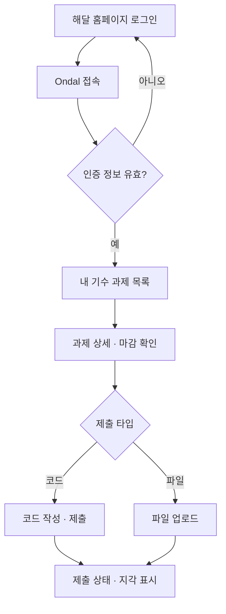
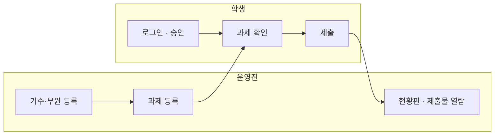

# Ondal MVP (P1) 스코프

> P1의 범위와 완료 기준 정의 문서 - 스코프 논쟁 발생 시 이 문서 기준으로 판단.
> 범위 변경 시 `결정` 이슈 선행 필수.

## 1. 한 줄 정의

**운영진이 과제를 올리고, 학생이 제출하고, 운영진이 누가 냈는지 확인하는 최소 루프.**

- 이 루프 1회 완주 = P1 완료
- 루프에 불필요한 기능 = P1 범위 밖

## 2. 해결하는 문제

부트캠프 운영에서 과제 수합·현황 파악에 과다한 수작업 발생 (2026-08-02 회의).

- 과제 제출이 여러 채널(백준, 파일 전달 등)에 분산 → 수합 번거로움
- 제출/미제출 파악이 수작업
- 트랙마다 과제 형태 상이(코드 / 웹 결과물 파일) → 단일 방식으로 수령 불가

## 3. 사용자와 여정

### 학생

로그인 → 내 기수 과제 확인 → 제출 → 상태 확인

### 운영진

기수·부원 등록 → 과제 출제 → 현황 파악 → 제출물 열람

### MVP 루프

## 4. 기능 목록

| 여정 | 기능 | 근거 |
|------|------|------|
| 학생 · 진입 | 로그인 (홈페이지 연동 유력, 7절 참고) + 부원 확인 | 08-02: 홈페이지 정보 활용 |
| 학생 · 확인 | 내 기수 과제 목록·상세 (마감 표시) | 08-02: 자기 소속만 노출 |
| 학생 · 제출 | 본문(코드 텍스트 또는 zip 파일, 택1) + 링크(선택) - 최소 1개면 제출 가능. 과제별 타입 지정 없음 | 08-02: 코드 제출, 심화반은 파일 → 08-19 확정: 세 방식 상시 허용 (docs/db/schema.md) |
| 학생 · 사후 | 내 제출 상태 확인 - 미제출 / 제출(초록) / 제출(추가) / 지각(주황), 재제출 이력 열람 | 마감 로직의 결과 표시. 08-19 확정 (docs/db/schema.md) |
| 운영진 · 준비 | 기수 생성, 부원 등록 | |
| 운영진 · 출제 | 과제 등록·수정·삭제 (마감 설정. 삭제는 제출물 경고 후 연쇄) | |
| 운영진 · 파악 | 현황판: 과제별 제출 / 미제출 / 지각 명단 | 08-02: 관리자 대시보드 |
| 운영진 · 확인 | 제출물 열람 | |
| 공통 · 기반 | 역할(학생/운영진) 권한, 기수 기준 접근 제어 | 08-02 결정 |

## 5. 명시적 제외 목록

- P1에서 만들지 않는 기능 목록
- 추가 필요 시 `결정` 이슈 선행 필수

| 제외 기능 | 이유 | 배치 |
|-----------|------|------|
| 자동 채점 (Judge0) | 백준이라는 대체 수단이 있어 학기 운영 가능. 인프라 작업이 커서 분리 | P2 |
| 온라인 저지 모드 (공개 문제 풀 · 리더보드) | 과제 관리가 본체. OJ는 그 위에 얹는 추가 기능 | P3 |
| 티어 시스템 (경험치 + 달 위상 등급: 삭 → 망) | 정답 판정(P2 자동 채점)·문제 난이도(P3 OJ 출제)에 의존. 구상 메모(2026-08-25): XP 누적형, 문제별 첫 정답만 지급, `xp_events` 이력 테이블, 난이도·레벨 격차 보정 | P3 |
| 멘토 코멘트 · 점수 | 데이터 구조만 준비하고 기능은 제외 | P2 이후 |
| 알림 (디스코드 등) | P1은 미제출자 명단까지. 독촉은 사람이 한다 | P2 |
| 출석부 | P2 이월 확정 (2026-08-25) - FE 화면(학생 현황·운영진 관리)은 구현돼 있어 BE만 남음. 도입 시 차시(`session_no`)를 Session 엔티티로 승격 재검토 | P2 |
| 공지사항 (전체/분반 공지) | P1 루프 밖 - FE 화면(학생·운영진 관리)은 구현돼 있어 BE만 붙이면 됨. 배포 후 첫 개선 후보 (2026-08-25) | P2 |
| 대회 기능 | 스코프 동결 | P3 이후 |

## 6. 완료 기준 (Definition of Done)

- 아래 전 항목 체크 = P1 완료
- 미체크 항목 1개라도 존재 시 미완료

- [ ] 운영진: 기수 생성·부원 등록 가능
- [ ] 운영진: 마감 지정하여 과제 등록 가능
- [ ] 학생: 로그인 시 자기 기수의 과제만 노출
- [ ] 학생: 본문(코드 또는 zip)·링크 중 최소 1개로 제출 가능, 재제출 시 이력 누적
- [ ] 마감 경과 제출: 지각으로 표시
- [ ] 학생: 자기 제출 상태 확인 가능
- [ ] 운영진: 과제별 제출 / 미제출 / 지각 명단 조회 가능
- [ ] 운영진: 제출물 열람 가능
- [ ] 학생: 운영진 기능(등록·현황판) 접근 불가

## 7. 미확정 사항

| 항목 | 현재 상태 | 개발 가정 |
|------|-----------|-----------|
| 인증 방식 | 홈페이지 로그인 연동이 유력, 미확정. 폴백은 Google OAuth | 인증은 교체 가능한 부품으로 설계. 확정 전까지 스텁 인증으로 개발 진행 |
| 부트캠프 2학기 일정·규모 | 교육운영진 확인 중 | 확정 시 마일스톤 날짜 설정 |
| DB | PostgreSQL 16 확정 - P1 스키마는 docs/db/schema.md | 개발은 로컬 PostgreSQL 기준 |

---

- 관련 문서: [회의록 2026-08-02](meetings/2026.08.02%20%ED%9A%8C%EC%9D%98%EB%A1%9D.md) · [의사결정 기록](decisions/)
- P1 범위의 진실의 원천 = 이 문서. CLAUDE.md의 로드맵은 이 문서를 참조
